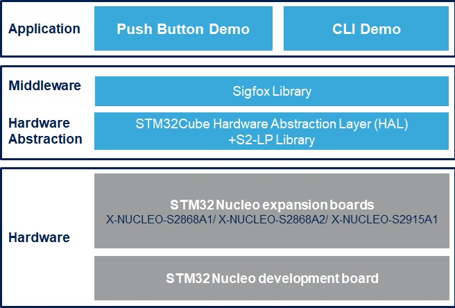

# X-CUBE-SFXS2LP1 Firmware Package

The X-CUBE-SFXS2LP1 is an expansion software package for STM32Cube. This software provides S2-LP Sigfox library with a complete set of API to develop embedded applications. The pack can be installed and configured by user using CubeMX.User applications can be built using Sigfox long range wireless area network running on the S2-LP high performance ultra-low power RF transceiver. Graphical user interface (GUI) PC application provides an interactive interface to transmit messages to the Sigfox network. The software comes with a sample implementation of the drivers running on the X-NUCLEO-S2868A1 expansion board connected to a NUCLEO-L073RZ, NUCLEO-L152RE or NUCLEO-L476RG development board. It is built on top of STM32Cube software technology that ease portability across different STM32 microcontrollers.

In this FW Package, the modules listed below are not directly accessible as they are subject to some restrictive license terms requiring user's approval via a "click thu" procedure. They have to be downloaded from the [www.st.com](https://www.st.com/content/st_com/en.html) website. The respective URL to download each one of these modules are available in a readme.txt file at the root of each folder.

* *Middlewares/Third_Party/Sigfox/Sigfox_STM32_Library*
* *Middlewares/Third_Party/Sigfox/Sigfox*

**X-CUBE-SFXS2LP1 software features**:

- Complete software to build applications using Sigfox long range wireless area network running on the S2-LP high performance ultra-low power RF transceiver.

- It provides an S2-LP Sigfox library with a complete set of APIs to develop embedded applications.

- Graphical user interface (GUI) PC application provides an interactive interface to transmit messages to the Sigfox network.

- Sample implementation available on X-NUCLEO-S2868A1/X-NUCLEO-S2868A2/X-NUCLEO-S2915A1 board connected to a NUCLEO-L073RZ, NUCLEO-L152RE or NUCLEO-L476RG development board.

- Easy portability across different MCU families, thanks to STM32Cube.

- Free user-friendly license terms

This package includes Sigfox v2.8.1 as Third Party Middleware. This
software is provided without modification.

Here is the list of references to user documents:

- [X-NUCLEO-S2868A1 SCHEMATIC](https://www.st.com/resource/en/schematic_pack/x-nucleo-s2868a1_schematic.pdf)
- [X-NUCLEO-S2868A2 SCHEMATIC](https://www.st.com/resource/en/schematic_pack/x-nucleo-s2868a2_schematic.pdf)
- [X-NUCLEO-S2915A1 SCHEMATIC](https://www.st.com/resource/en/schematic_pack/x-nucleo-s2915a1_schematic.pdf)
- [DS11896 Ultra-low power, high performance, sub-1GHz transceiver](https://www.st.com/resource/en/datasheet/s2-lp.pdf)
- [UM2405 Getting started with the X-NUCLEO-S2868A1 Sub-1 GHz 868 MHz RF expansion board based on S2-LP radio for STM32 Nucleo](https://www.st.com/resource/en/user_manual/dm00498153.pdf)
- [UM2638 Getting started with the X-NUCLEO-S2868A2 Sub-1 GHz 868 MHz RF expansion board based on S2-LP radio for STM32 Nucleo](https://www.st.com/resource/en/user_manual/dm00656126.pdf)
- [UM2641 Getting started with the X-NUCLEO-S2915A1 Sub-1 GHz 915 MHz RF expansion board based on S2-LP radio for STM32 Nucleo](https://www.st.com/resource/en/user_manual/dm00660355.pdf)
